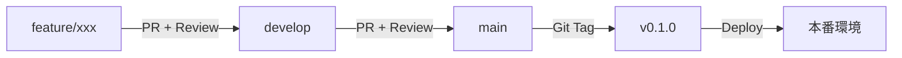
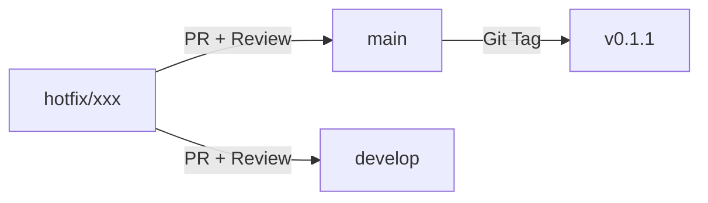

# Branch & Release Strategy - ブランチ・リリース戦略

**プロジェクト**: ミエルボード for 現場 / 現場WEEK  
**最終更新**: 2025-12-07

---

## 🎯 目的

将来のCD（継続的デプロイ）を見据えたブランチ運用ルールを定め、**どのブランチが何を表すか**を明確にします。

---

## 🌿 ブランチ種別

### 1. `main` - 本番相当

- **用途**: 本番環境にデプロイされるコード
- **保護**: ✅ 必須
  - 直接pushブロック
  - PR + レビュー必須
  - CI全グリーン必須
- **マージ元**: `develop` または `hotfix/*`
- **リリース**: このブランチへのマージ時にタグを打つ（`v0.1.0` など）

---

### 2. `develop` - ステージング／統合ブランチ

- **用途**: 機能を統合して検証する場所
- **保護**: ✅ 推奨
  - PR + レビュー推奨
  - CI全グリーン必須
- **マージ元**: `feature/*`
- **デプロイ**: ステージング環境（将来）

**注**: Phase 0では `develop` を省略し、`feature/*` → `main` でも可  
（チーム規模が小さい間は、シンプルな運用を優先）

---

### 3. `feature/*` - 機能開発ブランチ

- **命名規則**: `feature/機能名` または `feature/issue番号-機能名`
  - 例: `feature/weekly-board`
  - 例: `feature/WBS-12-schedule-api`
- **起点**: `develop`（または `main`）
- **マージ先**: `develop`（または `main`）
- **ライフサイクル**: 機能実装完了後、マージして削除

---

### 4. `hotfix/*` - 緊急修正ブランチ

- **命名規則**: `hotfix/修正内容`
  - 例: `hotfix/auth-token-validation`
- **起点**: `main`
- **マージ先**: `main` **および** `develop`（両方に即座に反映）
- **ライフサイクル**: 修正完了後、即座にマージして削除

---

## 📦 リリースフロー

### 通常リリース（feature → main）



#### 手順

1. `feature/*` でPR作成 → `develop` へマージ
2. ステージングで検証（将来）
3. `develop` → `main` へPR作成 → マージ
4. **タグを打つ**:
   ```bash
   git tag -a v0.1.0 -m "Release v0.1.0: 週間ボード初期実装"
   git push origin v0.1.0
   ```
5. （将来）GitHub Actions が `v*` タグを検知して自動デプロイ

---

### 緊急修正（hotfix → main）



#### 手順

1. `main` から `hotfix/*` を切る
2. 修正後、**`main` と `develop` 両方にPR**
3. マージ後、パッチバージョンのタグを打つ（`v0.1.1`）

---

## 🏷️ バージョニングルール（Semantic Versioning）

### 形式: `vMAJOR.MINOR.PATCH`

| 種別 | 例 | タイミング |
|------|-------|-----------|
| **MAJOR** | `v1.0.0` | 破壊的変更（API仕様変更など） |
| **MINOR** | `v0.2.0` | 新機能追加 |
| **PATCH** | `v0.1.1` | バグ修正・軽微な改善 |

### Phase 0の例

- `v0.1.0`: 週間ボード初期実装
- `v0.1.1`: カレンダー連携バグ修正
- `v0.2.0`: 入出荷スケジュール追加（Phase 1）

---

## 🚀 CI/CD連携（将来）

### 自動デプロイトリガー

```yaml
# .github/workflows/deploy.yml (将来)
on:
  push:
    tags:
      - 'v*'

jobs:
  deploy:
    runs-on: ubuntu-latest
    steps:
      - name: Deploy to Production
        run: |
          # ConoHa VPS へのデプロイ処理
          # Docker イメージのビルド＆プッシュ
```

---

## ✅ チェックリスト

### feature/* ブランチ作成時

- [ ] Issue番号を含む命名（`feature/WBS-12-xxx`）
- [ ] `develop`（または `main`）から分岐

### PR作成時

- [ ] PRテンプレートの必須項目を埋める
- [ ] CIが全グリーン
- [ ] レビュアーをアサイン

### main へのマージ時

- [ ] ステージングで検証済み（将来）
- [ ] バージョンタグを打つ
- [ ] リリースノートを書く（GitHub Releases）

---

## 🔗 関連ファイル

- `.github/workflows/ci.yml` - CI設定
- `docs/DONE_DEFINITION.md` - 完了定義
- `docs/GITHUB_SETUP_GUIDE.md` - 保護ブランチ設定


