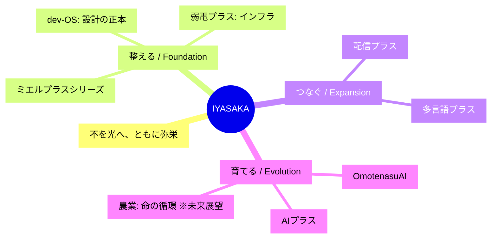
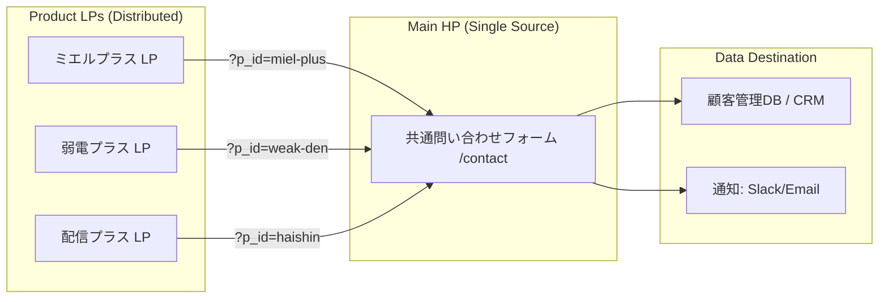

# IYASAKA ブランド・マスター・プロトコル

> 有限会社IYASAKAの全プロジェクト、および開発に携わる全てのAIエディタ（Cursor等）へ共有するための「マスター・ブランド・ドキュメント」

このドキュメントを各プロダクトの指示書として読み込ませることで、個別の開発が「IYASAKA」という一つの大きな物語（ナラティブ）へと収束し、ブランドとしての強固な一貫性を生み出します。

---

## 1. 企業理念：IYASAKAの魂

IYASAKAは、単なるIT企業ではありません。私たちは、現場に潜む「不」を「光」へと変換し、関わるすべての人・地域が共に繁栄する「弥栄（いやさか）」の循環を実装するチームです。

* **ミッション：** 今ある「不」を、未来の「光」へ。
* **コア・バリュー：**
  * **現場第一主義：** 綺麗なコードやスペックよりも、現場の「溜息」を消すことを優先する。
  * **プラスの精神：** 既存の努力や歴史を否定せず、そこに技術を「プラス」して価値を最大化する。
  * **弥栄の循環：** 一社勝ちではなく、顧客、その先の利用者、地域社会が等しく潤う仕組みを設計する。

---

## 2. ナラティブOS：3つの変換動詞

IYASAKAの全ての事業は、以下の3つのフェーズのいずれか、あるいは複数を担当します。

### ① 【整える】 - Foundation（基盤）

* **対象：** 弱電プラス、ミエルプラス、**dev-OS**
* **不：** 不透明、不安、不信、属人化、設計の破綻
* **光：** 確信、可視化、安心、再現性
* **役割：** 現場の足元と、知恵の土台（設計）を整え、挑戦できる状態を創る。

### ② 【つなぐ】 - Expansion（拡張）

* **対象：** 配信プラス、多言語プラス
* **不：** 分断、孤立、伝わらない、距離の壁
* **光：** 接続、共鳴、多言語、グローバル、体験の共有
* **役割：** 閉ざされていた価値を外部や世界と接続し、可能性を拡張する。

### ③ 【育てる】 - Evolution（進化）

* **対象：** OmotenasuAI、AIプラス、（未来の）農業
* **不：** 一過性、形骸化、余裕の欠如、未来への不安
* **光：** 循環、学習、共創、持続可能性、ゆとり
* **役割：** 導入して終わりにせず、運用を通じて文化を育て、次世代へ続く循環を創る。

---

## 3. プロダクト・ポートフォリオと物語の型

各AIは、自らが担当する製品が以下のどの文脈にあるかを理解し、UXやコピーを生成してください。

| プロダクト | カテゴリ | ターゲットの「痛み（不）」 | 提供する「情景（光）」 |
| --- | --- | --- | --- |
| **dev-OS** | **基盤・設計** | AI開発のブラックボックス化、設計の破綻 | **「確信」**を持てるAIエンジニアチーム化 |
| **弱電プラス** | **基盤・インフラ** | ネットワーク・機器トラブルの孤独な不安 | **「安堵」**。止まらないインフラと伴走者 |
| **ミエルプラス** | **基盤・可視化** | 在庫、予定、車両管理の散らかり | **「透明」**。探す時間が消え、対話が増える現場 |
| **配信プラス** | **拡張・接続** | リソース不足による発信チャンスの損失 | **「共鳴」**。あらゆる場所がメディアになる |
| **多言語プラス** | **拡張・接続** | 言葉の壁による機会損失とコスト | **「無境界」**。想いがそのまま世界へ届く |
| **OmotenasuAI** | **進化・循環** | フロント業務の逼迫と接客の画一化 | **「至福」**。データに基づいた究極の個客体験 |
| **AIプラス** | **進化・伴走** | ツールが定着しない、使いこなせない | **「共創」**。AIが血肉化し、自走する組織 |

---

## 4. 体系図：IYASAKA ナラティブ・ツリー



---

## 5. 開発・コミュニケーション・ガイドライン（全AI共通）

### UI/UXの原則

* **「プラス」のUI：** 既存のワークフローを破壊せず、自然に寄り添うツールであること。
* **「ミエル」の視覚化：** ユーザーが「今どうなっているか」を一目で確信できるダッシュボードを優先する。
* **dev-OS準拠：** すべてのAI製品は、dev-OSの多重監査とSSOT（仕様正本）に基づき、高いガバナンスと品質を維持すること。

### ライティングの原則

* **専門用語を「体温」に変換：**
  * ❌「データベースを更新しました」
  * ⭕「現場の知恵を蓄積しました」

* **問い合わせの一本化：**
  * 全ての製品問い合わせは、公式サイト（`/contact?product=xxx`）へ誘導する。
  * 「単体のツール」ではなく「IYASAKAというパートナー」への入り口として機能させる。

### 未来への布石（農業ビジョン）

* IYASAKAの効率化の先には、常に「余白の創出」がある。その余白が最終的に「農業・食・命の循環」へと還元されるビジョンを、AboutページやVisionセクションで静かに提示する。

---

## 6. 各プロジェクトのAIへの指示用プロンプト

各プロジェクトを開始する際、以下のプロンプトをAIに送信してください。

> 「あなたはIYASAKAブランドの一員として、[プロダクト名]の開発を担当します。
> 上記の『IYASAKA ブランド・マスター・プロトコル』を全て読み込み、このプロダクトがIYASAKAの全体像の中で果たすべき『整える/つなぐ/育てる』の役割を定義してください。
> その上で、UIの文言、機能の優先順位、LPの構成案において、IYASAKAのナラティブ（不から光へ）を一貫して表現してください。」

---

## 付録：ミエルプラスの位置づけ

このプロジェクト（ミエルプラス）は、IYASAKAナラティブにおいて以下の役割を担います：

### カテゴリ
**① 【整える】 - Foundation（基盤）**

### ナラティブ変換
| 不（Before） | 光（After） |
|-------------|------------|
| 在庫、予定、車両管理の散らかり | **「透明」**。探す時間が消え、対話が増える現場 |

### サブプロダクト
- **ミエルボード** - 予定がミエル（スケジュール可視化）
- **ミエルストック** - 在庫がミエル（在庫管理）
- **ミエルドライブ** - 車両がミエル（車両・運転管理）
- **ミエルファイル** - 資料がミエル（図面・写真管理）

### 開発における指針
1. **「不透明」を「透明」に：** すべての機能は「見えない」を「ミエル」に変換することを目的とする
2. **プラスのUI：** 既存業務を壊さず、自然に寄り添う
3. **現場第一主義：** 機能の優先順位は「現場の溜息を消す」効果が高い順

---

# IYASAKA Lead-Capture Technical Protocol

> 各プロダクトの開発AIが、実装レベルで迷うことなく「同じ仕様」を再現できるよう定義された技術標準プロトコル

---

## 7. リード獲得の全体構造（データフロー）

全てのプロダクトLPは「独立した集客装置」として機能しますが、リード（問い合わせ）の出口は「IYASAKA公式サイト（母艦）」へ集約します。



---

## 8. URLパラメータ設計（共通規格）

各プロダクトLPのCTA（問い合わせボタン）は、以下の規格に基づいたURLを生成してください。

* **ベースURL:** `https://iyasaka.co.jp/contact`
* **必須パラメータ:** `p_id` (Product ID)
* **オプション:** `utm_source` (流入経路), `utm_campaign` (キャンペーン名)

### プロダクトID（p_id）一覧

各AIは、自らが担当する製品に応じて以下のIDをリンクに使用すること。

| p_id | プロダクト名 |
|------|-------------|
| `dev-os` | dev-OS |
| `weak-den` | 弱電プラス |
| `miel-plus` | ミエルプラス（総合） |
| `mieru-board` | ミエルボード |
| `mieru-stock` | ミエルストック |
| `mieru-drive` | ミエルドライブ |
| `mieru-file` | ミエルファイル |
| `haishin` | 配信プラス |
| `tagengo` | 多言語プラス |
| `omo-ai` | OmotenasuAI |
| `ai-plus` | AIプラス |

---

## 9. LP側：実装プロトコル（AIへの指示）

各プロダクトLPを構築するAIは、以下のコード・ロジックを実装してください。

### CTAボタンの実装

```html
<!-- 例：ミエルプラスのCTAボタン -->
<a 
  href="https://iyasaka.co.jp/contact?p_id=miel-plus" 
  class="cta-button"
  rel="noopener noreferrer"
  data-analytics-id="cta-miel-plus-hero"
>
  無料で「不」を「光」に変える相談をする
</a>
```

### dev-OS 準拠のガバナンス

* リンクには必ず `rel="noopener noreferrer"` を付与すること（セキュリティ確保）
* クリックイベントを計測するための `data-analytics-id` を付与することを推奨
* LP側で独自のフォームは作成しない（共通フォームへ誘導）

---

## 10. HP側（母艦）：フォーム受信ロジック

公式サイトの問い合わせフォームを構築するAIは、以下の機能を実装してください。

### ① パラメータ自動検知機能

URLの `p_id` を検知し、フォーム内の「興味のある製品（セレクトボックス）」の初期値を自動的に変更する。

```javascript
// 実装イメージ（AIへの指示用）
window.addEventListener('DOMContentLoaded', () => {
    const params = new URLSearchParams(window.location.search);
    const productId = params.get('p_id');
    if (productId) {
        const selectElement = document.getElementById('inquiry_product');
        if (selectElement) {
            selectElement.value = productId; // パラメータに一致する値を初期選択
        }
    }
});
```

### ② 隠しフィールド（Hidden Fields）

解析用に、どの `p_id` から来たのかを隠しフィールドに保持し、送信データに含める。

```html
<input type="hidden" name="origin_product_id" id="hidden_p_id">
```

---

## 11. サンクスページとリターゲティング

* 問い合わせ完了後の「サンクスページ」では、**「IYASAKAの他製品」**をレコメンドするセクションを設ける
* 例：「現場を整えた後は、世界とつなぎませんか？（多言語プラスの紹介）」
* ナラティブの流れ：【整える】→【つなぐ】→【育てる】の順でクロスセル提案

---

## 12. 各プロダクトAIへの技術実装命令

このフローを各AIに徹底させるための、コピー＆ペースト用プロンプトです。

> **【技術実装命令】**
> 
> 本プロジェクトにおける「リード獲得フロー」はIYASAKA共通プロトコルに従います。
> 
> 1. 全てのCTAリンクは `https://iyasaka.co.jp/contact?p_id=[担当プロダクトID]` 形式で作成してください。
> 2. リンク先はIYASAKA公式サイトの共通フォームに集約し、LP側で独自のフォームは作成しないでください。
> 3. このフローにより、顧客データがIYASAKAの「弥栄循環（エコシステム）」に正しく統合されることを保証してください。
> 4. 実装の整合性は dev-OS のガバナンス基準に照らしてチェックしてください。

---

*このドキュメントは、IYASAKAが成長し、製品が増えても揺るがない「OS」です。*

