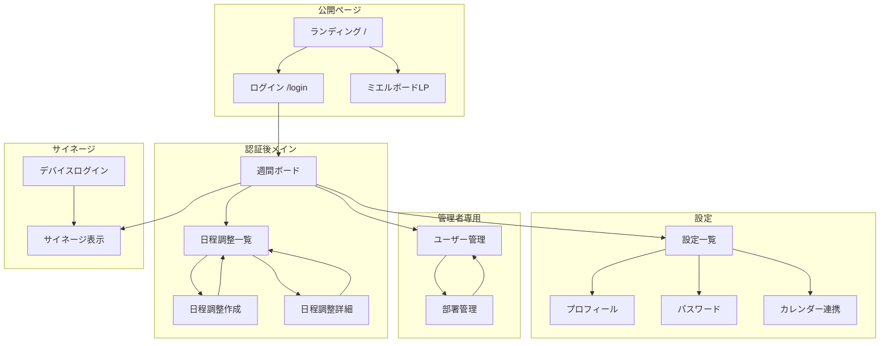

# SSOT: UI/UXナビゲーション設計 [DETAIL]

> 機能ID: FEAT-NAV-001
> ステータス: Implemented
> 最終更新: 2026-02-05
> 関連: SSOT-2 UI_STATE

**プロジェクト**: ミエルボード for 現場
**モジュール**: UI/UXナビゲーション
**バージョン**: v1.0
**層**: DETAIL（Freeze 4） - 止まらないルール適用

---

## 12セクション形式マッピング

| # | セクション | 対応する既存セクション |
|---|-----------|----------------------|
| 1 | 概要 | §1 このドキュメントの位置づけ |
| 2 | ユーザーストーリー | §4 権限別アクセス制御 |
| 3 | 画面仕様 | §2 画面一覧, §5 画面遷移図 |
| 4 | API仕様 | SSOT-3参照 |
| 5 | データモデル | SSOT-4参照 |
| 6 | ビジネスロジック | §3 メニュー構成 |
| 7 | エラーハンドリング | SSOT-5参照 |
| 8 | セキュリティ | §4 権限別アクセス制御 |
| 9 | パフォーマンス | TBD |
| 10 | テストケース | §6 必須UI要素チェックリスト |
| 11 | 実装メモ | §7 今後の修正タスク |
| 12 | 未決事項 | §8 関連ドキュメント |  
**最終更新**: 2026-01-30  
**ステータス**: 実装中

---

## 1. このドキュメントの位置づけ

このドキュメントは **UI/UXナビゲーション設計の唯一の正（Single Source of Truth）** です。

全画面・メニュー構成・権限・遷移を定義し、新機能追加時に必ず参照・更新してください。

---

## 2. 画面一覧

### 2-1. 公開ページ（未認証）

| パス | 画面名 | 概要 | ステータス |
|------|--------|------|----------|
| `/` | ランディングページ | 製品紹介・料金・FAQ・CTA | 実装済み |
| `/login` | ログイン | メールアドレスからテナント自動判定 | 実装済み |
| `/products/board` | ミエルボードLP | 製品詳細・使い方・料金 | 実装済み |
| `/products/stock` | ミエルストックLP | 在庫管理製品紹介 | 未実装 |
| `/products/drive` | ミエルドライブLP | 車両管理製品紹介 | 未実装 |

### 2-2. 認証後ページ（全ユーザー共通）

| パス | 画面名 | 概要 | 権限 | ステータス |
|------|--------|------|------|----------|
| `/org/[slug]/weekly-board` | 週間ボード | 社員×曜日マトリクス表示 | 全員 | 実装済み |
| `/org/[slug]/signage` | サイネージ | 大画面表示・自動スクロール | 全員 | 実装済み |
| `/org/[slug]/display` | 表示リダイレクト | weekly-board?fullscreen=trueへ | 全員 | 実装済み |
| `/meetings` | 日程調整一覧 | 自分の調整リスト | 全員 | 実装済み |
| `/meetings/new` | 日程調整作成 | 新規調整リクエスト | 全員 | 実装済み |
| `/meetings/[id]` | 日程調整詳細 | 候補選択・回答・確定 | 全員 | 実装済み |

### 2-3. 設定ページ

| パス | 画面名 | 概要 | 権限 | ステータス |
|------|--------|------|------|----------|
| `/settings` | 設定一覧 | 設定メニュー一覧 | 全員 | 未実装 |
| `/settings/profile` | プロフィール | 名前編集 | 全員 | 実装済み |
| `/settings/password` | パスワード変更 | パスワード変更 | 全員 | 実装済み |
| `/settings/calendar` | カレンダー連携 | Googleカレンダー同期 | 全員 | 実装済み |

### 2-4. 管理ページ（ADMIN専用）

| パス | 画面名 | 概要 | 権限 | ステータス |
|------|--------|------|------|----------|
| `/admin/users` | ユーザー管理 | 一覧・追加・編集・削除 | ADMIN | 実装済み |
| `/admin/departments` | 部署管理 | 一覧・追加・編集・削除 | ADMIN | 実装済み |

### 2-5. 組織別ログイン

| パス | 画面名 | 概要 | ステータス |
|------|--------|------|----------|
| `/org/[slug]/login` | 組織別ログイン | 組織固有ログイン | 実装済み |
| `/org/[slug]/device-login` | デバイスログイン | サイネージ用 | 実装済み |

---

## 3. メニュー構成

### 3-1. ヘッダー左側：ブランド・プロダクトスイッチャー

| 項目 | 遷移先 | 表示条件 | ステータス |
|------|--------|---------|----------|
| ミエルボード | `/org/{slug}/weekly-board` | 常時（アクティブ表示） | 実装済み |
| ミエルストック | `/products/stock` | 常時（準備中表示） | 要修正 |
| ミエルドライブ | `/products/drive` | 常時（準備中表示） | 要修正 |

### 3-2. ヘッダー中央：メインナビゲーション

| 項目 | 遷移先 | 表示条件 | ステータス |
|------|--------|---------|----------|
| 週間ボード | `/org/{slug}/weekly-board` | 認証済み | 実装済み |
| 日程調整 | `/meetings` | 認証済み | 実装済み |

### 3-3. ヘッダー右側：ユーザーメニュー

#### 設定セクション（全ユーザー）

| 項目 | 遷移先 | ステータス |
|------|--------|----------|
| プロフィール | `/settings/profile` | 実装済み |
| パスワード変更 | `/settings/password` | 実装済み |
| カレンダー連携 | `/settings/calendar` | 未実装（要追加） |

#### 管理セクション（ADMIN専用）

| 項目 | 遷移先 | ステータス |
|------|--------|----------|
| ユーザー管理 | `/admin/users` | 実装済み |
| 部署管理 | `/admin/departments` | 実装済み |

#### その他

| 項目 | 動作 | ステータス |
|------|------|----------|
| ログアウト | セッション破棄→ログイン画面 | 実装済み |

---

## 4. 権限別アクセス制御

### 4-1. ロール定義

| ロール | 表示名 | 説明 |
|--------|--------|------|
| ADMIN | 管理者 | 全機能アクセス可（管理画面含む） |
| LEADER | リーダー | 部署メンバーのスケジュール編集可 |
| MEMBER | 一般 | 自分のスケジュールのみ編集可 |
| DEVICE | デバイス | サイネージ表示専用 |

### 4-2. 画面別アクセス権限

| 画面カテゴリ | MEMBER | LEADER | ADMIN | DEVICE |
|-------------|--------|--------|-------|--------|
| 週間ボード（閲覧） | O | O | O | O |
| 自分のスケジュール編集 | O | O | O | X |
| 部署メンバーのスケジュール編集 | X | O | O | X |
| 全員のスケジュール編集 | X | X | O | X |
| 日程調整 | O | O | O | X |
| 設定（プロフィール・パスワード） | O | O | O | X |
| カレンダー連携 | O | O | O | X |
| 管理画面 | X | X | O | X |
| サイネージ編集 | X | X | O | O |

---

## 5. 画面遷移図

---

## 6. 必須UI要素チェックリスト

新機能追加時に必ず確認してください。

### 6-1. ヘッダー・ナビゲーション

- [ ] ヘッダー（AppHeader）が表示されているか
- [ ] 適切なレイアウト（default.vue）を使用しているか
- [ ] ヘッダーメニューにリンクが追加されているか（必要な場合）

### 6-2. 導線

- [ ] この画面への導線（リンク）が存在するか
- [ ] 「戻る」導線が存在するか
- [ ] 関連画面への遷移リンクがあるか

### 6-3. 権限

- [ ] 権限チェックが実装されているか（middleware/admin.ts等）
- [ ] 権限不足時のリダイレクト先が設定されているか
- [ ] 権限別の表示制御が正しく動作するか

### 6-4. レスポンシブ

- [ ] モバイル表示で崩れないか
- [ ] タッチ操作に対応しているか（必要な場合）

---

## 7. 今後の修正タスク

| 優先度 | 項目 | 詳細 |
|--------|------|------|
| P0 | カレンダー連携リンク | AppHeader設定メニューに追加 |
| P0 | 設定一覧ページ | /settings/index.vue を新規作成 |
| P1 | プロダクトスイッチャー | 未実装製品は「準備中」表示に変更 |
| P2 | ミエルストックLP | /products/stock を作成 |
| P2 | ミエルドライブLP | /products/drive を作成 |

---

## 8. 関連ドキュメント

- [SSOT_APP_HEADER.md](./SSOT_APP_HEADER.md) - 共通ヘッダー詳細仕様
- [SSOT_MVP_EXTEND.md](./SSOT_MVP_EXTEND.md) - 管理画面拡張
- [SSOT_MEETING_SCHEDULER.md](./SSOT_MEETING_SCHEDULER.md) - 日程調整機能
