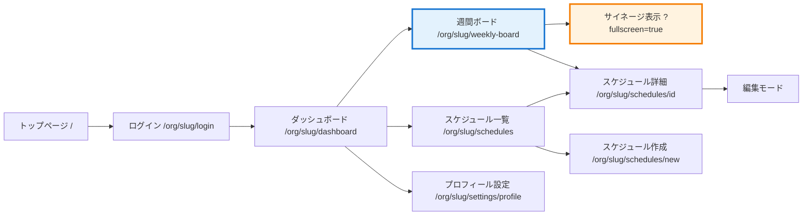

# UI・ルーティング設計: ミエルボード for 現場

**プロジェクト**: ミエルボード for 現場  
**モジュール**: 現場WEEK（Phase 0）  
**最終更新**: 2025-12-16  
**バージョン**: v3.1（管理AIレビュー反映版・表現精緻化）

---

## ⚠️ 重要な前提

### このドキュメントの適用範囲

**このドキュメントは「将来のNuxt 3 フロントエンド実装」の設計書です。**

**本リポジトリの現状**:
- ⚠️ **バックエンドAPI実装ファイル（Nuxt/Nitro想定）**が存在（`server/api/`, `server/utils/`）
- ❌ **フロントエンド実装**は存在しない（`pages/`, `components/`, `layouts/` なし）
- ❌ **Nuxt 3 設定**も存在しない（`nuxt.config.ts`, `app.vue` なし）
- ❌ `npm run dev` は `node server/index.js` を起動するのみで、**HTTP API（`/api/*`）は提供されない**

**つまり**:
- このドキュメントに記載された **UIページ・コンポーネントはすべて未作成**
- バックエンドAPIは **ファイルとして存在するが、現状は実行環境（Nuxt/Nitro + TSツールチェーン + Prisma）が未整備のため動作不能**
- フロントエンド実装は **別ブランチまたは別リポジトリで行う想定**

---

## 📋 このドキュメントについて

このドキュメントは **ミエルボード for 現場のUI・ルーティング設計** を定義します。

**目的**:
- フロントエンド実装の **設計指針** を提供
- URL構造・ページ遷移・コンポーネント階層を事前設計
- バックエンドAPIとの接続仕様を明確化

**⚠️ 注意**:
- このドキュメントは **設計書** であり、実装状況ではありません
- 実装時は SSOT (`docs/SSOT_GENBA_WEEK.md`) を最優先してください
- 実装とドキュメントが乖離した場合は **SSOT を正** とし、両方を更新してください

**参照SSOT**:
- `docs/SSOT_GENBA_WEEK.md` - 設計SSOT（最優先）
- `docs/phase0_weak_current_spec.md` - 詳細仕様
- `docs/phase0_architecture.md` - アーキテクチャ設計

---

## 🗺️ URL設計の基本方針

### マルチテナント構造

すべての組織内ページは **`/org/[slug]/`** を prefix とします。

```
/org/[slug]/...
```

- `slug`: 組織の識別子（例: `succeed`）
- `organizationId` への変換は middleware で処理（**未実装**）
- すべてのAPIリクエストに `organizationId` が付与される（**実装方針**）

### 認証フロー（設計）

```
1. ユーザーがアクセス
2. 未認証の場合 → /org/[slug]/login にリダイレクト
3. ログイン成功 → JWT Cookie 発行
4. requireAuth() で認証チェック + organizationId 取得
```

**⚠️ 実装状況**:
- `requireAuth()` 関数: **未実装**（`server/utils/authMiddleware.ts` が存在しない）
- Prisma クライアント: **未実装**（`server/utils/prisma.ts` が存在しない）
- Prisma Middleware による自動フィルタ: **未実装**（設計上の方針）

---

## 📊 URL一覧

### 凡例

| 記号 | 意味 |
|-----|------|
| 🔧 | バックエンドAPI実装中（修復必要） |
| 📝 | 未作成（設計のみ） |
| 🔜 | Phase 1 以降 |

---

## 1️⃣ 公開ページ（未認証）

### Phase 0

| URL | ページ名 | 役割 | 実装ファイル | 状態 |
|-----|---------|------|------------|------|
| `/` | トップページ | サービス紹介・ログイン導線 | 📝 `pages/index.vue` | 未作成 |
| `/org/[slug]/login` | ログイン | 認証（JWT発行） | 📝 `pages/org/[slug]/login.vue` | 未作成 |

### Phase 1+

| URL | ページ名 | 役割 | 実装ファイル | 状態 |
|-----|---------|------|------------|------|
| `/signup` | 新規登録 | 組織・ユーザー登録 | 📝 `pages/signup.vue` | 🔜 Phase 1 |
| `/org/[slug]/forgot-password` | パスワード再設定 | パスワードリセット | 📝 `pages/org/[slug]/forgot-password.vue` | 🔜 Phase 1 |

---

## 2️⃣ 認証済みページ（組織内）

### 2-1. 管理画面（共通レイアウト）

**URL構造**: `/org/[slug]/*`

#### Phase 0

| URL | ページ名 | 役割 | 権限 | 実装ファイル | 状態 |
|-----|---------|------|------|------------|------|
| `/org/[slug]/dashboard` | ダッシュボード | 組織のホーム画面 | Level 1+ | 📝 `pages/org/[slug]/dashboard.vue` | 未作成 |
| `/org/[slug]/weekly-board` | **週間スケジュールボード** | **現場WEEK** メイン画面 | Level 1+ | 📝 `pages/org/[slug]/weekly-board.vue` | 未作成 |
| `/org/[slug]/weekly-board?fullscreen=true` | **週間ボード（サイネージ）** | TV表示用フルスクリーン | Level 1+ | 📝 `pages/org/[slug]/weekly-board.vue` | 未作成 |
| `/org/[slug]/schedules` | スケジュール一覧 | 全スケジュールの一覧・検索 | Level 1+ | 📝 `pages/org/[slug]/schedules/index.vue` | 未作成 |
| `/org/[slug]/schedules/new` | スケジュール作成 | 新規スケジュール登録 | Level 3+ | 📝 `pages/org/[slug]/schedules/new.vue` | 未作成 |
| `/org/[slug]/schedules/[id]` | スケジュール詳細 | スケジュールの詳細・編集 | Level 1+ | 📝 `pages/org/[slug]/schedules/[id].vue` | 未作成 |
| `/org/[slug]/settings/profile` | プロフィール設定 | 個人情報・パスワード変更 | Level 1+ | 📝 `pages/org/[slug]/settings/profile.vue` | 未作成 |

#### Phase 1+

| URL | ページ名 | 役割 | 権限 | 実装ファイル | 状態 |
|-----|---------|------|------|------------|------|
| `/org/[slug]/employees` | 社員一覧 | 社員の一覧・検索 | Level 3+ | 📝 `pages/org/[slug]/employees/index.vue` | 🔜 Phase 1 |
| `/org/[slug]/employees/[id]` | 社員詳細 | 社員情報・スケジュール | Level 1+ | 📝 `pages/org/[slug]/employees/[id].vue` | 🔜 Phase 1 |
| `/org/[slug]/settings` | 組織設定 | 組織情報・部門・役職 | Level 5 | 📝 `pages/org/[slug]/settings/index.vue` | 🔜 Phase 1 |
| `/org/[slug]/stock` | 在庫管理（現場STOCK） | 入出荷スケジュール | Level 3+ | 📝 `pages/org/[slug]/stock/index.vue` | 🔜 Phase 1 |
| `/org/[slug]/alcohol` | アルコールチェック（現場ALCOHOL） | チェック記録 | Level 3+ | 📝 `pages/org/[slug]/alcohol/index.vue` | 🔜 Phase 1 |
| `/org/[slug]/ai` | AIコンシェルジュ（現場AI） | 自然文入力 | Level 1+ | 📝 `pages/org/[slug]/ai/index.vue` | 🔜 Phase 2 |

---

## 🧭 ページ遷移図

### Phase 0 の遷移フロー



**注**: `slug` は実際の組織識別子（例: `succeed`）に置き換わります。

---

## 🔌 API エンドポイント対応表

### 週間ボード関連（Phase 0）

| ページ | 使用API | メソッド | 実装状態 |
|-------|---------|---------|---------|
| `/org/[slug]/weekly-board` | `/api/schedules/weekly-board` | GET | 🔧 実装中（要修復） |
| `/org/[slug]/weekly-board?fullscreen=true` | `/api/schedules/weekly-board` | GET | 🔧 実装中（要修復） |

### API 仕様（実装コード準拠）

#### GET `/api/schedules/weekly-board`

**実装ファイル**: `server/api/schedules/weekly-board.get.ts`

**⚠️ 実装状況**:
- ファイルは存在するが、**依存関係が未解決**
  - `~/server/utils/authMiddleware` → **未実装**
  - `~/server/utils/prisma` → **未実装**
- **現状では動作不能**

**リクエストパラメータ**（実装コード準拠）:
```typescript
{
  startDate?: string      // 週の開始日（YYYY-MM-DD）、未指定時は今週
  departmentId?: string   // 部門ID（optional）
}
```

**レスポンス** (実装コード準拠):
```typescript
{
  success: boolean
  weekStart: string                // "2025-12-16"
  weekEnd: string                  // "2025-12-22"
  employees: [
    {
      id: string
      name: string
      email: string
      department: string | null     // 部門名
      departmentId: string | null   // 部門ID
      schedules: {
        monday?: {
          scheduleId: string
          displayText: string       // "9-18 ◯◯ホテル 工事"
          start: string             // ISO8601
          end: string               // ISO8601
          title: string
          isHoliday: boolean
        }
        // ... 以下同様
      }
    }
  ]
  organizationId: string
}
```

**認証・権限**（設計上の方針）:
- `requireAuth()` で認証チェック（**未実装**）
- `organizationId` による自動フィルタ（**未実装**）
- Prisma Middleware で自動適用（**未実装**）

---

## 🚀 実装優先順位（Phase 0）

### ステップ0: バックエンド基盤の完成（最優先）

| 順位 | 項目 | 実装ファイル | 備考 |
|-----|------|------------|------|
| 0-1 | 認証ミドルウェア | 🔧 `server/utils/authMiddleware.ts` | **新規作成必須** |
| 0-2 | Prisma クライアント | 🔧 `server/utils/prisma.ts` | **新規作成必須** |
| 0-3 | Prisma Middleware | 🔧 prisma 設定ファイル | **organizationId 自動フィルタ** |
| 0-4 | 週間ボードAPI修復 | 🔧 `server/api/schedules/weekly-board.get.ts` | 依存解決 |
| 0-5 | テスト環境整備 | 🔧 `vitest` インストール + 設定 | **現状未実行可能** |

### ステップ1: Nuxt プロジェクトのセットアップ

| 順位 | 項目 | 実装ファイル | 備考 |
|-----|------|------------|------|
| 1-1 | Nuxt 3 初期化 | 📝 `nuxt.config.ts` | **別ブランチ推奨** |
| 1-2 | ディレクトリ構造作成 | 📝 `pages/`, `components/`, `layouts/` | - |
| 1-3 | 共通レイアウト | 📝 `layouts/OrgLayout.vue` | 基盤 |

### ステップ2: 週間ボードUI実装

| 順位 | 項目 | 実装ファイル | 備考 |
|-----|------|------------|------|
| 2-1 | 週間ボードページ | 📝 `pages/org/[slug]/weekly-board.vue` | メイン画面 |
| 2-2 | 週間ボードコンポーネント | 📝 `components/genba/WeeklyScheduleBoard.vue` | メインコンポーネント |
| 2-3 | スケジュールセル | 📝 `components/genba/ScheduleCell.vue` | 再利用可能 |

---

## 📊 実装状況トラッキング

### バックエンドAPI（Phase 0）

| API | エンドポイント | 実装状況 | テスト | 課題 |
|-----|-------------|---------|-------|------|
| 週間ボード | `/api/schedules/weekly-board` | 🔧 要修復 | ❌ 未実行 | 依存未解決 |

**凡例**:
- 🔧 = 実装中（修復必要）
- ❌ = 未実装
- ✅ = 実装完了

### フロントエンドUI（Phase 0）

| ページ | URL | 実装状況 | 備考 |
|-------|-----|---------|------|
| ログイン | `/org/[slug]/login` | ❌ 未実装 | Nuxt未セットアップ |
| ダッシュボード | `/org/[slug]/dashboard` | ❌ 未実装 | Nuxt未セットアップ |
| 週間ボード | `/org/[slug]/weekly-board` | ❌ 未実装 | Nuxt未セットアップ |

---

## ⚠️ 重要な課題と制約

### 1. SSOTとの乖離

**SSOT の方針**: `Schedule.metadata` (Json フィールド) で拡張  
**実装の現状**: `Schedule.description` (String) に JSON を格納

**対応方針**:
- [ ] SSOT を更新して `description` 使用を正式化
- [ ] または実装を変更して `metadata` を使用

**参照**:
- `docs/SSOT_GENBA_WEEK.md` (Line 112-118, 210-222)
- `server/utils/scheduleFormatter.ts` (Line 6-9, 40-62)

---

### 2. 実装の依存関係

**未実装の依存**:
1. `~/server/utils/authMiddleware.ts` - **最優先で実装必須**
2. `~/server/utils/prisma.ts` - **最優先で実装必須**
3. Prisma Middleware - organizationId 自動フィルタ

**参照**:
- `server/api/schedules/weekly-board.get.ts` (Line 13-15)

---

### 3. テスト実行環境

**問題点**:
- `vitest` が `package.json` の dependencies に含まれていない
- テストスクリプトは存在するが、実行不能

**対応（要・方針確定）**:
- `docs/ai_development_context.md` では「package.jsonの変更禁止」と書かれているため、
  **vitest導入（= package.json更新）が許容されるかを、管理AI判断で確定してから実施**してください。

**対応案（許容された場合）**:
```bash
pnpm add -D vitest
```

**参照**:
- `package.json` (Line 5-14)

---

### 4. OpenAPI との整合性

**OpenAPI の認証方式**: `bearerAuth` + `orgId` クエリパラメータ  
**本設計の認証方式**: Cookie + JWT + `/org/[slug]/` パス

**対応方針**:
- [ ] OpenAPI を本設計に合わせて更新
- [ ] または本設計を OpenAPI に合わせて修正

**参照**:
- `openapi.yaml` (Line 96-106)

---

## 🔗 関連ドキュメント

### SSOT・仕様
- `docs/SSOT_GENBA_WEEK.md` - 設計SSOT（**最優先参照**）
- `docs/phase0_weak_current_spec.md` - 詳細仕様
- `docs/phase0_architecture.md` - アーキテクチャ設計

### 品質管理
- `docs/TEST_STRATEGY.md` - テスト戦略
- `docs/DONE_DEFINITION.md` - 完了の定義
- `docs/QUALITY_MANAGEMENT_OVERVIEW.md` - 品質管理概要

### 開発手順
- `docs/TAG_COMMANDS.md` - タグコマンド方式
- `docs/BRANCH_AND_RELEASE.md` - ブランチ戦略

---

## 📝 更新履歴

| 日付 | バージョン | 更新者 | 内容 |
|------|----------|-------|------|
| 2025-12-16 | v1.0 | 設計AI | 初版作成 |
| 2025-12-16 | v2.0 | 設計AI | 管理AIレビュー反映（URL統一・API実装準拠） |
| 2025-12-16 | v3.0 | 設計AI | 適用範囲明確化・実装状況正確化・課題明記 |
| 2025-12-16 | v3.1 | 設計AI | 表現精緻化（ローカルパス削除・実行環境の詳細追記） |

---

## 📌 まとめ

### このドキュメントの位置づけ

- ✅ **設計書**として有効
- ⚠️ **実装ガイド**としては不完全（依存未解決）
- ❌ **実装状況**の記録ではない

### 次のアクション

**1. バックエンド基盤の完成**（最優先）
- `authMiddleware.ts` の実装
- `prisma.ts` の実装
- Prisma Middleware の実装
- 週間ボードAPIの修復
- テスト環境の整備

**2. SSOT との整合**
- データ拡張方針の統一
- OpenAPI との整合

**3. フロントエンド実装開始**
- Nuxt 3 プロジェクトのセットアップ
- 本ドキュメントに沿ったUI実装

---

**設計AIより**: v3.1 では、ローカルパスを削除し、実行環境の詳細を追記しました。バックエンド基盤（Nuxt/Nitro + Prisma）の整備が最優先です。
