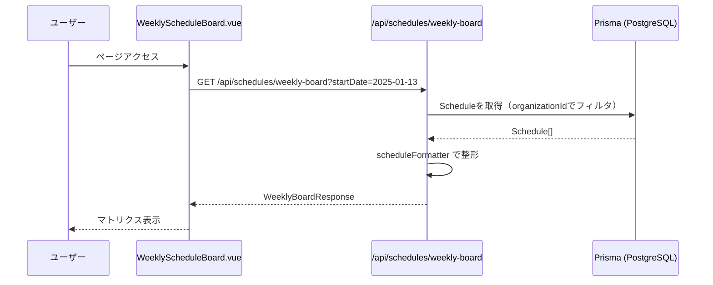
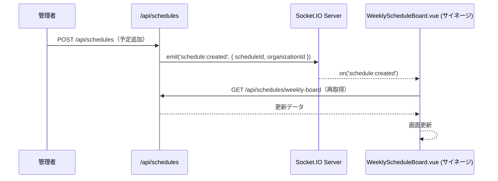

# Phase 0 詳細仕様: 現場WEEK（週間スケジュールボード）

**プロジェクト**: ミエルボード for 現場  
**モジュール**: 現場WEEK  
**Phase**: 0（初期実装）  
**最終更新**: 2025-12-07

---

## 📋 このドキュメントについて

このドキュメントは **Phase 0（現場WEEK）の実装詳細仕様** です。

**参照SSOT**: `docs/SSOT_GENBA_WEEK.md` を必ず先に読んでください。

---

## 🎯 Phase 0 のスコープ

### 実装する機能

- ✅ 週間スケジュールボード表示（社員 × 曜日マトリクス）
- ✅ 部門フィルタ（全員 / 工事 / 営業 / 保守）
- ✅ 週切り替え（前週 / 今週 / 翌週）
- ✅ サイネージ表示モード
- ✅ 既存カレンダーからのデータ取得（手動同期でもOK）

### 実装しない機能（Phase 1以降）

- ❌ 自動カレンダー同期（定期実行）
- ❌ AIコンシェルジュ（自然文入力）
- ❌ 入出荷スケジュール
- ❌ 在庫・資産管理
- ❌ アルコールチェック

---

## 🖥️ 画面仕様

### 1. 週間スケジュールボード

#### URL

```
/org/[slug]/weekly-board
```

#### レイアウト

```
┌────────────────────────────────────────────────────────────────┐
│ 現場WEEK - 週間スケジュールボード                                   │
│                                            [全員 ▼]  ← [今週] → │
├────────┬──────┬──────┬──────┬──────┬──────┬──────┬──────┤
│ 社員   │ 月   │ 火   │ 水   │ 木   │ 金   │ 土   │ 日   │
├────────┼──────┼──────┼──────┼──────┼──────┼──────┼──────┤
│田中太郎│ 9-18 │ 9-18 │ 9-18 │ 休み │ 9-18 │      │      │
│ (工事) │◯◯ホテル│◯◯ホテル│△△旅館│      │◯◯ホテル│      │      │
│        │新館工事│新館工事│打合せ│      │新館工事│      │      │
├────────┼──────┼──────┼──────┼──────┼──────┼──────┼──────┤
│佐藤花子│ 10-16│ 9-18 │ 9-18 │ 9-18 │ 10-16│      │      │
│ (営業) │ 打合せ│◯◯ホテル│◯◯ホテル│◯◯ホテル│ 打合せ│      │      │
│        │      │新館工事│新館工事│新館工事│      │      │      │
└────────┴──────┴──────┴──────┴──────┴──────┴──────┴──────┘
```

---

#### UI要素

| 要素 | 仕様 | 備考 |
|------|------|------|
| **ヘッダー** | `現場WEEK - 週間スケジュールボード` | 固定表示 |
| **部門フィルタ** | ドロップダウン: `全員` / `工事` / `営業` / `保守` | 選択時に即座にフィルタ |
| **週切り替え** | `[←]` ボタン / `[今週]` 表示 / `[→]` ボタン | クリックで前週/翌週へ |
| **社員列** | 社員名 + 部門名（カッコ内） | 例: `田中太郎 (工事)` |
| **曜日列** | `月` / `火` / `水` / `木` / `金` / `土` / `日` | 日本語表記 |
| **セル** | 時間 + 現場名 + 用件 | 例: `9-18 ◯◯ホテル 新館工事` |

---

#### レスポンシブ対応

| デバイス | 対応 | 備考 |
|---------|------|------|
| **PC（1920x1080）** | ✅ 完全対応 | サイネージ表示推奨 |
| **タブレット（横）** | ✅ 対応 | 管理者が確認用 |
| **スマホ** | ⚠️ 最低限 | 横スクロールで閲覧可能 |

**サイネージ優先**: PC（TV）での表示を最優先で設計

---

#### 色分け・視覚デザイン

| 要素 | 色 | 備考 |
|------|---|------|
| **ヘッダー背景** | 濃いグレー (`#2c3e50`) | - |
| **曜日ヘッダー** | ライトグレー (`#ecf0f1`) | - |
| **社員名背景** | ホワイト | - |
| **セル背景（通常）** | ホワイト | - |
| **セル背景（休み）** | ライトグレー (`#f5f5f5`) | - |
| **セル背景（予定あり）** | 薄い青 (`#e3f2fd`) | - |
| **フォント** | ゴシック体、16px以上 | サイネージで見やすく |

---

### 2. サイネージ表示モード

#### URL

```
/org/[slug]/weekly-board?fullscreen=true
```

または、UI上の「フルスクリーン」ボタンをクリック

#### 仕様

- ヘッダー・ナビゲーションを非表示
- 週間ボードのみを全画面表示
- 自動リロード（5分ごと）
- リアルタイム更新（Socket.IO）

---

## 🔌 API仕様

### 1. 週間ボードデータ取得

#### エンドポイント

```
GET /api/schedules/weekly-board
```

#### リクエストパラメータ

```typescript
interface WeeklyBoardRequest {
  startDate: string;        // 週の開始日（YYYY-MM-DD）
  department?: string;      // 部門フィルタ（optional）
}
```

**例**:
```
GET /api/schedules/weekly-board?startDate=2025-01-13&department=工事
```

#### レスポンス

```typescript
interface WeeklyBoardResponse {
  weekStart: string;          // "2025-01-13"
  weekEnd: string;            // "2025-01-19"
  employees: EmployeeSchedule[];
}

interface EmployeeSchedule {
  id: string;
  name: string;
  department: string;
  schedules: {
    monday?: DaySchedule;
    tuesday?: DaySchedule;
    wednesday?: DaySchedule;
    thursday?: DaySchedule;
    friday?: DaySchedule;
    saturday?: DaySchedule;
    sunday?: DaySchedule;
  };
}

interface DaySchedule {
  scheduleId: string;
  displayText: string;        // "9-18 ◯◯ホテル 新館工事"
  start: string;              // ISO8601
  end: string;                // ISO8601
  siteName?: string;
  activityType?: string;
  isHoliday: boolean;
}
```

**レスポンス例**:

```json
{
  "weekStart": "2025-01-13",
  "weekEnd": "2025-01-19",
  "employees": [
    {
      "id": "emp-1",
      "name": "田中太郎",
      "department": "工事",
      "schedules": {
        "monday": {
          "scheduleId": "sch-1",
          "displayText": "9-18 ◯◯ホテル 新館工事",
          "start": "2025-01-13T09:00:00Z",
          "end": "2025-01-13T18:00:00Z",
          "siteName": "◯◯ホテル",
          "activityType": "工事",
          "isHoliday": false
        },
        "thursday": {
          "scheduleId": "sch-2",
          "displayText": "休み",
          "isHoliday": true
        }
      }
    }
  ]
}
```

#### 認証・権限

- ✅ `requireAuth()` 必須
- ✅ `organizationId` による自動フィルタ
- ✅ 権限レベル 1 以上（全員閲覧可能）

---

### 2. スケジュール作成（管理者用）

#### エンドポイント

```
POST /api/schedules
```

#### リクエストボディ

```typescript
interface CreateScheduleRequest {
  userId: string;
  start: string;              // ISO8601
  end: string;                // ISO8601
  metadata: {
    siteName?: string;
    activityType?: string;
  };
}
```

#### レスポンス

```typescript
interface CreateScheduleResponse {
  id: string;
  userId: string;
  start: string;
  end: string;
  organizationId: string;
  metadata: object;
  createdAt: string;
}
```

#### 認証・権限

- ✅ `requireAuth()` 必須
- ✅ 権限レベル 3 以上（リーダー・管理者のみ）

---

## 📦 データモデル

### Schedule テーブル（既存）

**スキーマ変更なし**

```prisma
model Schedule {
  id             String   @id @default(uuid())
  userId         String
  organizationId String
  start          DateTime
  end            DateTime
  metadata       Json?    // ← ここに追加情報を格納
  createdAt      DateTime @default(now())
  updatedAt      DateTime @updatedAt
  
  user         User         @relation(fields: [userId], references: [id])
  organization Organization @relation(fields: [organizationId], references: [id])
}
```

---

### Schedule.metadata の構造

```typescript
interface ScheduleMetadata {
  siteName?: string;        // 現場名（例: "◯◯ホテル"）
  activityType?: string;    // 用件（例: "工事", "打合せ", "保守"）
  displayText?: string;     // 表示用テキスト（自動生成でもOK）
}
```

**例**:

```json
{
  "siteName": "◯◯ホテル",
  "activityType": "新館工事",
  "displayText": "9-18 ◯◯ホテル 新館工事"
}
```

---

## 🧩 コンポーネント構成

### フロントエンド

#### 新規作成

| ファイル | 役割 | 備考 |
|---------|------|------|
| `components/genba/WeeklyScheduleBoard.vue` | 週間ボードマトリクス表示 | メインコンポーネント |
| `components/genba/ScheduleCell.vue` | 1セル分の表示 | 再利用可能 |
| `components/genba/WeekNavigator.vue` | 週切り替えUI | `[←] [今週] [→]` |
| `components/genba/DepartmentFilter.vue` | 部門フィルタ | ドロップダウン |
| `pages/org/[slug]/weekly-board.vue` | 週間ボードページ | ルーティング |
| `composables/useWeeklyBoard.ts` | 週間ボード用の状態管理 | Pinia Store |

---

#### 既存コンポーネントの参考

| ファイル | 参考にする点 |
|---------|------------|
| `WeeklyCalendar.vue` | カレンダー表示のレイアウト |
| `EmployeeScheduleMatrix.vue` | 社員×日付のマトリクス構造 |

---

### バックエンド

#### 新規作成

| ファイル | 役割 | 備考 |
|---------|------|------|
| `server/api/schedules/weekly-board.get.ts` | 週間ボード用データ取得API | メインAPI |
| `server/utils/scheduleFormatter.ts` | スケジュール表示テキスト整形 | ユーティリティ |

---

#### `scheduleFormatter.ts` 詳細

```typescript
// server/utils/scheduleFormatter.ts

export function formatScheduleForDisplay(schedule: Schedule): string {
  // 休日判定
  if (schedule.metadata?.isHoliday) {
    return "休み";
  }
  
  const start = formatTime(schedule.start);  // "9"
  const end = formatTime(schedule.end);      // "18"
  const siteName = schedule.metadata?.siteName || "";
  const activityType = schedule.metadata?.activityType || "";
  
  return `${start}-${end} ${siteName} ${activityType}`.trim();
  // => "9-18 ◯◯ホテル 新館工事"
}

function formatTime(isoString: string): string {
  const date = new Date(isoString);
  return date.getHours().toString();
}
```

---

## 🔄 データフロー

### 1. 週間ボード表示フロー



---

### 2. リアルタイム更新フロー（Socket.IO）



---

## 🎨 UI/UXガイドライン

### サイネージ表示の原則

1. **大きめフォント**: 16px以上（遠くからでも見やすく）
2. **シンプルな色分け**: 3色以内（白・グレー・青）
3. **横スクロールなし**: 画面内に収める
4. **自動リロード**: 5分ごと
5. **リアルタイム更新**: Socket.IO で即座に反映

---

### アクセシビリティ

- ✅ コントラスト比 4.5:1 以上
- ✅ キーボード操作可能
- ✅ スクリーンリーダー対応（`aria-label` 付与）

---

## 🧪 テスト要件

### 必須テスト（`docs/TEST_STRATEGY.md` 参照）

#### 1. ユニットテスト

- ✅ `scheduleFormatter.ts` のロジック
- ✅ `useWeeklyBoard.ts` の状態管理

#### 2. 統合テスト

- ✅ `GET /api/schedules/weekly-board` のマルチテナント境界
  - 他組織のスケジュールが含まれないこと
  - `organizationId` によるフィルタが正しく動作すること

#### 3. E2Eテスト（Phase 1以降）

- ✅ 週間ボード表示 → 週切り替え → 部門フィルタ

---

## 🚀 実装優先順位

### Sprint 1（Week 1）

1. ✅ API実装（`/api/schedules/weekly-board.get.ts`）
2. ✅ `scheduleFormatter.ts` 実装
3. ✅ ユニットテスト作成

### Sprint 2（Week 2）

4. ✅ `WeeklyScheduleBoard.vue` 実装
5. ✅ `ScheduleCell.vue` 実装
6. ✅ 統合テスト作成

### Sprint 3（Week 3）

7. ✅ 週切り替え・部門フィルタ実装
8. ✅ サイネージ表示モード実装
9. ✅ リアルタイム更新（Socket.IO）実装

---

## ⚠️ 制約・注意事項

### データベース

- ❌ **スキーマ変更は原則禁止（例外: 管理AI承認 + 影響範囲修正が揃う場合のみ）**
- ✅ `Schedule.metadata` で拡張

### マルチテナント

- ❌ `organizationId` なしのクエリ禁止
- ✅ すべてのAPIで `requireAuth()` + `organizationId` フィルタ

### SQL

- ❌ 生SQL（`prisma.$queryRaw`）禁止
- ✅ Prisma ORMのみ使用

---

## 🔗 関連ドキュメント

- `docs/SSOT_GENBA_WEEK.md` - 設計SSOT（必読）
- `docs/phase0_architecture.md` - アーキテクチャ設計
- `docs/UI_ROUTING_MAP.md` - UI・ルーティング設計（URL一覧・遷移図）
- `docs/TEST_STRATEGY.md` - テスト戦略
- `docs/DONE_DEFINITION.md` - 完了の定義

---

**この仕様書は、SSOT に基づいて作成されています。仕様変更があれば、まず SSOT を更新してください。**


