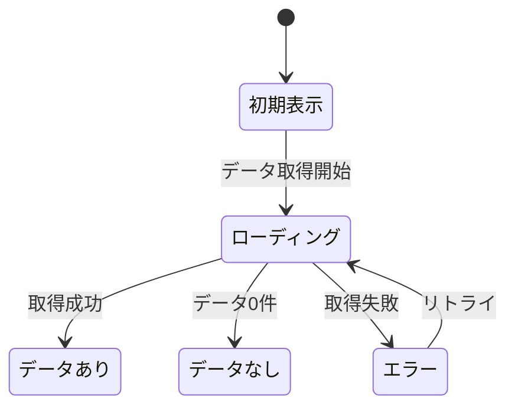

# 12_SSOT_FORMAT.md - SSOT フォーマット定義

> IEEE/ISO/IEC 29148:2018 + RFC 2119 準拠の機能仕様書フォーマット

---

## 準拠規格

| 規格 | 適用範囲 |
|------|---------|
| ISO/IEC/IEEE 29148:2018 | 要件エンジニアリング全体の構造 |
| IEEE 830 (SRS) | ソフトウェア要求仕様の記述方法 |
| RFC 2119 | 要求レベル定義（MUST / SHOULD / MAY） |
| ISO/IEC 25010:2011 | ソフトウェア品質特性（非機能要件） |
| OpenAPI 3.0 | API仕様の記述形式 |

---

## RFC 2119 要求レベル定義

```
MUST（必須）:
  この要件は絶対に満たさなければならない。
  満たさない場合、機能は未完成とみなす。

SHOULD（推奨）:
  この要件は満たすことが強く推奨される。
  正当な理由がある場合に限り省略可能。
  省略する場合は理由をADRに記録する。

MAY（任意）:
  この要件は実装してもしなくてもよい。
  実装する場合はこの仕様に従う。

MUST NOT（禁止）:
  この動作は絶対に許可してはならない。

SHOULD NOT（非推奨）:
  この動作は正当な理由がない限り避けるべき。
```

---

## SSOT 3層構造

### 基本概念

```
従来: 一枚岩のSSOT（全情報がフラット）
問題: 変更頻度が異なる情報が同列 → 安定すべき情報まで頻繁に変更される

改善: SSOTを3層に分離し、変更頻度と影響度で管理する

┌─────────────────────────────────────────────────────────────────┐
│  SSOT-Detail（変更される前提）                                    │
│  例外、文言、バリデーション詳細、UI微調整                          │
│  → 自由に変更可能。Decision Backlog で未決定も許容               │
├─────────────────────────────────────────────────────────────────┤
│  SSOT-Contract（破壊しない約束）                                  │
│  API契約、画面I/O、イベント、DB主要テーブル                       │
│  → 変更時は影響分析必須。破壊的変更はADRに記録                   │
├─────────────────────────────────────────────────────────────────┤
│  SSOT-Core（変わりにくい）                                       │
│  目的、対象ユーザー、用語、権限モデル、主要フロー                  │
│  → 原則変更不可。変更はステークホルダー承認必須                   │
└─────────────────────────────────────────────────────────────────┘
```

### 各層の定義

```
SSOT-Core（変わりにくい）:
────────────────────────────────
  含まれるもの:
  - §2.1 目的（この機能が存在する理由）
  - §2.2 スコープ（含まれるもの / 含まれないもの）
  - §2.3 ユーザーストーリー
  - §2.4 ユーザーフロー（主要フロー）
  - §7 ビジネスルール（コアルール）
  - 用語定義
  - 権限モデル（誰が何をできるか）

  変更ルール:
  - Freeze 1 以降は原則変更不可
  - 変更する場合はステークホルダー承認 + ADR記録
  - 影響を受ける全SSOTの更新が必要


SSOT-Contract（破壊しない約束）:
────────────────────────────────
  含まれるもの:
  - §5 API仕様（エンドポイント、リクエスト/レスポンス型）
  - §6.1 画面一覧・画面遷移
  - §4.1 データ項目一覧（主要テーブル・カラム）
  - §6.4 状態遷移図
  - イベント定義（Pub/Sub、Webhook等）

  変更ルール:
  - Freeze 2 以降は破壊的変更禁止
  - 追加（新エンドポイント、新カラム）は可能
  - 破壊的変更が必要な場合:
    1. 影響分析を実施
    2. ADRに記録
    3. マイグレーション計画を作成


SSOT-Detail（変更される前提）:
────────────────────────────────
  含まれるもの:
  - §4.2 バリデーションルール（詳細な条件）
  - §6.2 画面レイアウト（ワイヤーフレーム詳細）
  - §6.3 状態一覧（UI状態の詳細）
  - §8 非機能要件（性能目標の微調整）
  - §9 エラーハンドリング（エラーメッセージ文言）
  - UI文言・ラベル
  - 例外ケースの詳細

  変更ルール:
  - いつでも変更可能
  - Decision Backlog で未決定を許容
  - 変更時は変更履歴に記録
```

### テンプレートへのマーキング

```
SSOTテンプレートの各セクションに層を明記する:

  §2 機能概要 [CORE]
  §4 データ仕様 [CONTRACT: 4.1] [DETAIL: 4.2, 4.3]
  §5 API仕様 [CONTRACT]
  §6 UI仕様 [CONTRACT: 6.1, 6.4] [DETAIL: 6.2, 6.3, 6.5]
  §7 ビジネスルール [CORE: コアルール] [DETAIL: 例外ルール]
  §8 非機能要件 [DETAIL]
  §9 エラーハンドリング [DETAIL]

層のタグ:
  [CORE] = 変更時はステークホルダー承認
  [CONTRACT] = 破壊的変更禁止、追加は可
  [DETAIL] = 自由に変更可能
```

---

## Decision Backlog（決定バックログ）

### 基本概念

```
未決定事項を一元管理し、開発を止めずに進める。

従来: §12 TBD がゼロでないと監査不合格
改善: Decision Backlog に未決定を記録し、デフォルト案で実装を進める

Decision Backlog ≠ SSOT
  - SSOTとは別ファイルで管理
  - 決定後にSSOTに反映
  - 定期的にレビューして消化
```

### ファイル構成

```
docs/
├── ssot/
│   └── DECISION_BACKLOG.md      ← Decision Backlog（プロジェクト全体）
│
└── design/features/
    └── FEAT-XXX/
        └── FEAT-XXX_decisions.md ← 機能別 Decision Backlog（任意）
```

### Decision Backlog テンプレート

```markdown
# Decision Backlog

> 未決定事項の一覧。定期的にレビューし、決定後はSSOTに反映する。

## 未決定一覧

| ID | 項目 | 重要度 | 期限 | 影響範囲 | デフォルト案 | ステータス |
|----|------|--------|------|---------|------------|----------|
| DB-001 | | High/Med/Low | YYYY-MM-DD | DB/API/UI/運用 | | Open/Decided/Deferred |

## 各項目の詳細

### DB-001: [項目名]

- **重要度**: High / Med / Low
- **期限**: YYYY-MM-DD（いつまでに決めないと詰むか）
- **影響範囲**: [DB / API / UI / 運用 のどれに影響するか]
- **背景**: [なぜ未決定なのか]
- **選択肢**:
  - A) [案A] → 副作用: [副作用の説明]
  - B) [案B] → 副作用: [副作用の説明]
  - C) [案C] → 副作用: [副作用の説明]
- **推奨デフォルト**: [案X]（理由: [推奨理由]）
- **現在の実装**: [デフォルト案で仮実装済み / Feature Flag で隠蔽中 / 未実装]
- **関連SSOT**: [影響を受けるSSOTのID・セクション]
- **起票日**: YYYY-MM-DD
- **起票トリガー**: [T1-T7 のどれか / 実装中に発覚 / レビュー指摘]

### 決定時の記録

- **決定日**: YYYY-MM-DD
- **決定内容**: [採用した案]
- **決定者**: [誰が決めたか]
- **SSOT反映**: [更新したSSOTのID・セクション]
```

### 重要度の判定基準

```
High（早急に決定が必要）:
────────────────────────────────
  - DBスキーマに影響する（マイグレーション必要）
  - API契約に影響する（破壊的変更の可能性）
  - 他の機能の実装がブロックされる
  - 期限: 1週間以内

Med（次のスプリントまでに決定）:
────────────────────────────────
  - UIの動作に影響する
  - ビジネスルールの詳細
  - 期限: 2週間以内

Low（決まったら反映）:
────────────────────────────────
  - UI文言・ラベル
  - エラーメッセージの文言
  - 非機能要件の微調整
  - 期限: 特になし（デフォルトで十分）
```

---

## Example-driven 仕様（必須セクション）

### 基本原則

```
抽象的な要件定義だけでは実装者が迷う。
具体的な入力例 → 出力例があれば、仕様の解釈が一意に定まる。

ルール:
  SSOTの §3 機能要件の各MUST要件に対して、
  以下の4項目を必須とする:
  1. 入力例 → 出力例（最低5ケース）
  2. 境界値（最大/最小/空/NULL/不正）
  3. 例外時の戻り（エラーコード・文言・リトライ可否）
  4. 受け入れテスト（Gherkin形式）
```

### §3-E: Example Table（入出力例）

```markdown
### FR-001 の入出力例

| # | 入力 | 条件 | 期待出力 | 備考 |
|---|------|------|---------|------|
| 1 | email: "user@example.com", password: "Valid1!" | 正常 | 200, {token, user} | 基本の正常系 |
| 2 | email: "USER@EXAMPLE.COM", password: "Valid1!" | email大文字 | 200, {token, user} | 大文字小文字を区別しない |
| 3 | email: "user@example.com", password: "wrong" | パスワード不一致 | 401, AUTH_001 | |
| 4 | email: "nonexist@example.com", password: "any" | 存在しないユーザー | 401, AUTH_001 | セキュリティ: 存在しないとは言わない |
| 5 | email: "", password: "" | 空入力 | 400, VAL_001 | |

最低5ケース。正常系2 + 異常系3 以上を推奨。
```

### §3-F: Boundary Values（境界値）

```markdown
### FR-001 の境界値

| 項目 | 最小値 | 最大値 | 空 | NULL | 不正形式 |
|------|--------|--------|-----|------|---------|
| email | "a@b.c" (5文字) | 254文字 | "" → VAL_001 | null → VAL_001 | "abc" → VAL_002 |
| password | 8文字 | 128文字 | "" → VAL_001 | null → VAL_001 | "短い" → VAL_003 |

各項目について最低5つの境界パターンを定義する。
```

### §3-G: Exception Response（例外時の戻り）

```markdown
### FR-001 の例外応答

| # | 例外条件 | HTTPステータス | エラーコード | ユーザーメッセージ | リトライ可否 | 復旧方法 |
|---|---------|---------------|------------|-----------------|------------|---------|
| 1 | パスワード不一致 | 401 | AUTH_001 | 「メールアドレスまたはパスワードが正しくありません」 | Yes | 再入力 |
| 2 | アカウントロック | 423 | AUTH_003 | 「アカウントがロックされています。30分後に再試行してください」 | Yes (30min) | 時間経過 |
| 3 | メール未認証 | 403 | AUTH_004 | 「メールアドレスの認証が完了していません」 | No | メール認証 |
| 4 | レート制限 | 429 | RATE_001 | 「試行回数の上限に達しました」 | Yes (60s) | 時間経過 |
| 5 | サーバーエラー | 500 | SYS_001 | 「一時的なエラーが発生しました」 | Yes | 自動復旧 |
```

### §3-H: Acceptance Tests（受け入れテスト - Gherkin形式）

```gherkin
Feature: FR-001 ログイン

  Scenario: 正常ログイン
    Given ユーザー "user@example.com" が登録済み
    And パスワードが "Valid1!" で設定済み
    When email "user@example.com" と password "Valid1!" でログインする
    Then ステータスコード 200 が返される
    And レスポンスに token が含まれる
    And レスポンスに user オブジェクトが含まれる

  Scenario: パスワード不一致
    Given ユーザー "user@example.com" が登録済み
    When email "user@example.com" と password "wrong" でログインする
    Then ステータスコード 401 が返される
    And エラーコード "AUTH_001" が返される

  Scenario: 5回連続失敗でアカウントロック
    Given ユーザー "user@example.com" が登録済み
    When 誤ったパスワードで5回連続ログインする
    Then ステータスコード 423 が返される
    And エラーコード "AUTH_003" が返される
    And 30分間ログイン不可になる

  Scenario: ロック解除後のログイン
    Given ユーザー "user@example.com" がロック中
    And 30分が経過した
    When 正しいパスワードでログインする
    Then ステータスコード 200 が返される
```

### タスク化時の自動生成フロー

```
SSOTの受け入れテスト（Gherkin）から、実際のテストコードを自動生成する:

  SSOT §3-H（Gherkin）
    │
    ▼
  framework run --generate-tests FEAT-XXX
    │
    ├── E2E テスト（Playwright / Cypress）
    │   → Gherkin の Scenario → テストケースに変換
    │
    ├── API テスト（Vitest / Jest）
    │   → Given/When/Then → リクエスト/アサーション に変換
    │
    └── テストデータ（Fixture）
        → Given 句 → テスト用データに変換

  Claude Code への指示:
  "FEAT-XXX の §3-H 受け入れテスト（Gherkin形式）から、
   以下を生成して:
   1. E2Eテスト（Playwright）
   2. APIテスト（Vitest）
   3. テストデータ（Fixture）

   各 Scenario を1つのテストケースに変換して。
   Given → テストセットアップ
   When → テスト実行
   Then → アサーション"
```

---

## SSOT テンプレート

```markdown
# [機能ID] [機能名] - 機能仕様書（SSOT）

> バージョン: 1.0
> ステータス: Draft / Review / Approved
> 最終更新: YYYY-MM-DD
> 作成者: [名前]
> 承認者: [名前]
> 親タスク: [PT-XXX]

---

## §1 文書情報

| 項目 | 内容 |
|------|------|
| 機能ID | [例: FEAT-001] |
| 機能名 | [例: AI画像分析] |
| ジャンル | [例: 画像分析フロー] |
| 親タスク | [例: PT-001] |
| 優先度 | P0 / P1 / P2 |
| 種別 | 個別機能 |
| 担当 | |
| 推定規模 | S / M / L / XL |

### 変更履歴

| バージョン | 日付 | 変更内容 | 変更者 |
|-----------|------|---------|-------|
| 1.0 | | 初版作成 | |

### 関連ドキュメント

| ドキュメント | 関係 |
|-------------|------|
| SSOT-0_PRD.md §X.X | 要件の根拠 |
| SSOT-1 [機能ID] | 機能カタログの該当行 |
| [関連機能ID] | 依存/連携 |

---

## §2 機能概要 [CORE]

### 2.1 目的
[この機能が存在する理由を1-2文で]

### 2.2 スコープ

#### 含まれるもの
- [MVP で実装する機能・操作]
- [MVP で実装する機能・操作]

#### 含まれないもの（明示的除外）
- [今回実装しないもの]
- [将来検討するもの]

### 2.3 ユーザーストーリー

```
[ペルソナ名] として、
[操作/機能] したい。
なぜなら [達成したい目的] だから。

受け入れ基準:
- [基準1]
- [基準2]
- [基準3]
```

### 2.4 ユーザーフロー

```
1. [ユーザーの操作ステップ1]
2. [ユーザーの操作ステップ2]
3. [システムの応答]
4. [ユーザーの操作ステップ3]
5. [最終結果]
```

---

## §3 機能要件 [CORE: FR] [DETAIL: 入出力例・境界値]

### RFC 2119 準拠の要件リスト

| 要件ID | レベル | 要件 | 検証方法 |
|--------|--------|------|---------|
| FR-001 | MUST | [要件の記述] | [テスト方法] |
| FR-002 | MUST | [要件の記述] | [テスト方法] |
| FR-003 | SHOULD | [要件の記述] | [テスト方法] |
| FR-004 | MAY | [要件の記述] | [テスト方法] |
| FR-005 | MUST NOT | [禁止事項] | [テスト方法] |

### 要件の詳細

#### FR-001: [要件名]
- **レベル**: MUST
- **説明**: [詳細な説明]
- **根拠**: PRD §X.X / ユーザーヒアリング
- **条件**: [前提条件があれば]
- **検証**: [どうテストするか]

### §3-E: Example Table（入出力例） [DETAIL]

| # | 入力 | 条件 | 期待出力 | 備考 |
|---|------|------|---------|------|
| 1 | [正常系の入力例] | 正常 | [期待出力] | |
| 2 | [正常系のバリエーション] | [条件] | [期待出力] | |
| 3 | [異常系の入力例] | [条件] | [エラー出力] | |
| 4 | [異常系の入力例] | [条件] | [エラー出力] | |
| 5 | [境界値の入力例] | [条件] | [期待出力] | |

**最低5ケース。正常系2 + 異常系3 以上。**

### §3-F: Boundary Values（境界値） [DETAIL]

| 項目 | 最小値 | 最大値 | 空 | NULL | 不正形式 |
|------|--------|--------|-----|------|---------|
| [項目1] | [値→結果] | [値→結果] | [結果] | [結果] | [結果] |

### §3-G: Exception Response（例外時の戻り） [DETAIL]

| # | 例外条件 | HTTPステータス | エラーコード | ユーザーメッセージ | リトライ可否 | 復旧方法 |
|---|---------|---------------|------------|-----------------|------------|---------|
| 1 | | | | | | |

### §3-H: Acceptance Tests（Gherkin形式） [DETAIL]

```gherkin
Feature: [FR-XXX] [要件名]

  Scenario: [正常系シナリオ]
    Given [前提条件]
    When [操作]
    Then [期待結果]

  Scenario: [異常系シナリオ]
    Given [前提条件]
    When [操作]
    Then [期待結果]
```

---

## §4 データ仕様 [CONTRACT: 4.1] [DETAIL: 4.2, 4.3]

### 4.1 データ項目一覧

| # | 項目名 | 物理名 | 型 | 必須 | デフォルト | バリデーション | 備考 |
|---|--------|--------|-----|------|----------|--------------|------|
| 1 | | | | | | | |
| 2 | | | | | | | |

### 4.2 バリデーションルール

| 項目 | ルール | エラーメッセージ |
|------|-------|----------------|
| | | |

### 4.3 データライフサイクル

```
作成: [いつ、どのように作成されるか]
更新: [いつ、どのように更新されるか]
削除: [削除方式: 物理削除/論理削除/アーカイブ]
保持期間: [いつまで保持するか]
```

---

## §5 API 仕様 [CONTRACT]

### 5.1 エンドポイント一覧

| メソッド | パス | 説明 | 認証 |
|---------|------|------|------|
| POST | /api/v1/xxx | | Required |
| GET | /api/v1/xxx/:id | | Required |

### 5.2 エンドポイント詳細

#### POST /api/v1/xxx

**リクエスト:**
```typescript
interface CreateXxxRequest {
  field1: string;    // [説明]
  field2?: number;   // [説明] (optional)
}
```

**レスポンス（成功: 201）:**
```typescript
interface CreateXxxResponse {
  data: {
    id: string;
    field1: string;
    createdAt: string;
  };
}
```

**レスポンス（エラー）:**
| ステータス | コード | 条件 |
|-----------|--------|------|
| 400 | VALIDATION_ERROR | バリデーション失敗 |
| 401 | UNAUTHORIZED | 未認証 |
| 403 | FORBIDDEN | 権限不足 |
| 409 | CONFLICT | 重複 |
| 500 | INTERNAL_ERROR | サーバーエラー |

---

## §6 UI 仕様 [CONTRACT: 6.1, 6.4] [DETAIL: 6.2, 6.3, 6.5]

### 6.1 画面一覧

| 画面ID | 画面名 | パス | 認証 |
|--------|--------|------|------|
| | | | |

### 6.2 画面レイアウト

```
[テキストベースのワイヤーフレーム]

┌─────────────────────────────────┐
│ ヘッダー                        │
├─────────────────────────────────┤
│                                 │
│  [主要コンテンツ]               │
│                                 │
├─────────────────────────────────┤
│ フッター / アクションバー       │
└─────────────────────────────────┘
```

### 6.3 状態一覧

| 状態 | 条件 | 表示内容 |
|------|------|---------|
| 初期表示 | | |
| ローディング | | |
| データあり | | |
| データなし（空状態） | | |
| エラー | | |

### 6.4 状態遷移図



### 6.5 操作フロー

| # | ユーザー操作 | システム応答 | 遷移先 |
|---|------------|------------|-------|
| 1 | | | |
| 2 | | | |

---

## §7 ビジネスルール [CORE]

### 7.1 ルール一覧

| ルールID | ルール名 | 条件 | アクション | レベル |
|---------|---------|------|----------|--------|
| BR-001 | | IF [条件] | THEN [動作] | MUST |
| BR-002 | | IF [条件] | THEN [動作] | SHOULD |

### 7.2 ルール詳細

#### BR-001: [ルール名]
- **条件**: [いつ適用されるか]
- **ロジック**: [具体的な処理]
- **例外**: [例外ケース]
- **根拠**: [なぜこのルールか]

---

## §8 非機能要件（ISO 25010 準拠） [DETAIL]

### 8.1 性能
| 指標 | 目標値 | 測定方法 |
|------|-------|---------|
| 応答時間 | [例: 3秒以内] | API レスポンスタイム |
| スループット | [例: 100 req/s] | 負荷テスト |
| データ量 | [例: 10万件まで] | 機能テスト |

### 8.2 セキュリティ
| 要件 | レベル | 対策 |
|------|--------|------|
| 認証 | MUST | [方式] |
| 認可 | MUST | [方式] |
| データ暗号化 | SHOULD | [方式] |
| 入力サニタイズ | MUST | [方式] |

### 8.3 可用性
| 要件 | 目標 |
|------|------|
| 稼働率 | [例: 99.9%] |
| 障害復旧時間 | [例: 1時間以内] |
| データバックアップ | [例: 日次] |

### 8.4 保守性
| 要件 | 対策 |
|------|------|
| ログ出力 | [レベルと内容] |
| モニタリング | [監視項目] |
| デプロイ | [手順] |

---

## §9 エラーハンドリング [DETAIL]

### 9.1 エラーケース一覧

| # | エラー条件 | 種別 | ユーザーメッセージ | システム動作 | 復旧方法 |
|---|----------|------|-----------------|------------|---------|
| 1 | | 入力エラー | | | |
| 2 | | 認証エラー | | | |
| 3 | | 外部API障害 | | | |
| 4 | | タイムアウト | | | |

### 9.2 エラー時のフォールバック

```
外部サービス障害時:
  1. [リトライ回数]回リトライ
  2. [フォールバック動作]
  3. ユーザーに[メッセージ]を表示
  4. エラーログを[レベル]で出力
```

---

## §10 テストケース

### 10.1 正常系

| TC-ID | テスト名 | 前提条件 | 操作 | 期待結果 | 優先度 |
|-------|---------|---------|------|---------|--------|
| TC-N-001 | | | | | P0 |
| TC-N-002 | | | | | P0 |

### 10.2 異常系

| TC-ID | テスト名 | 前提条件 | 操作 | 期待結果 | 優先度 |
|-------|---------|---------|------|---------|--------|
| TC-E-001 | | | | | P0 |
| TC-E-002 | | | | | P0 |

### 10.3 境界値

| TC-ID | テスト名 | 入力値 | 期待結果 |
|-------|---------|--------|---------|
| TC-B-001 | | 最小値 | |
| TC-B-002 | | 最大値 | |
| TC-B-003 | | 空 | |

### 10.4 テストカバレッジ

```
MUST要件: 全てテストケースが存在すること
SHOULD要件: 主要なケースのテストが存在すること
MAY要件: テスト任意
```

---

## §11 依存関係・影響範囲

### 11.1 依存する機能

| 依存先 | 依存内容 | 影響度 |
|--------|---------|--------|
| [機能ID] | [何を使うか] | 高/中/低 |

### 11.2 依存される機能

| 依存元 | 依存内容 | 影響度 |
|--------|---------|--------|
| [機能ID] | [何が使われるか] | 高/中/低 |

### 11.3 外部サービス依存

| サービス | 用途 | 障害時の影響 | フォールバック |
|---------|------|------------|--------------|
| | | | |

---

## §12 未決定事項・制約

### 12.1 未決定事項（TBD）

| # | 項目 | 層 | 理由 | Decision Backlog ID |
|---|------|-----|------|-------------------|
| | | CORE/CONTRACT/DETAIL | | DB-XXX |

**注意:**
- CORE層・CONTRACT層のTBD: 監査合格にはゼロであること
- DETAIL層のTBD: Decision Backlog に記録済みなら許容（デフォルト案で実装可）

### 12.2 前提条件

- [前提1]
- [前提2]

### 12.3 制約事項

- [制約1]
- [制約2]

---

## 監査情報

| 項目 | 内容 |
|------|------|
| 監査日 | |
| 監査スコア | /100 |
| 合格判定 | 合格 / 条件付き合格 / 不合格 |
| 指摘事項数 | Critical: / Major: / Minor: |
| 監査詳細 | 13_SSOT_AUDIT.md 参照 |
```

---

## 変更履歴

| 日付 | 変更内容 | 変更者 |
|------|---------|-------|
| | 初版作成 | |
| | SSOT 3層構造、Decision Backlog、Example-driven必須セクション追加 | |
